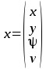

# CarND-Controls-MPC
Self-Driving Car Engineer Nanodegree Program

## Introduction
In this project I’ll implement Model Predictive Control to drive a
vehicle around the race track in simulator. Project has challenge
as there is 100ms delay to send commands to simulator so there need
to be a  way to handle latency in order to drive car safely on road.

### Videos

I have recorded couple of videos of achieved performance. Usually
controller is able to drive car around the track almost on full speed
with good stability, but on some situations car will get out of control
drive out of track. Lower speeds under 90mph are considered very stable.

* [MPC: 92mph with 100ms latency](https://youtu.be/PZYRxiZgAkc)
* [MPC: 102mph with 100ms latency](https://youtu.be/5RNDMe3sLbk)
* [MPC: 110mph with 100ms latency](https://youtu.be/6QXXEj-KyWo)
* [MPC: 110mph wno latency](https://youtu.be/XWf9jWTwk-M)

## Vehicle State

Vehicle state is presented by a simple kinematics which models
vehicle position, orientation and speed. It is  presented by
following vehicle state vector.




_Where_
x = horizontal position 
y = vertical position 
ψ= orientation (psi, yaw, heading)
v = speed (absolute velocity)

Control inputs can be presented by steering angle and combined
value for throttle and brake. Positive throttle values are accelerating
vehicle and negative values are decelerating vehicle.


_Where_
δ = steering angle
a = acceleration


By combining state and controls we’ll get full state vector
which presents vehicle’s state in the optimizer.


## Bicycle Kinematic Model

In this project I’m using bit simplified version bicycle model
which is quite enough for  car speed below  50mph in simulator.
If purpose is to go faster with this simplified model then you can
play with latency and look-ahead time which are used compensate lag.
I’m using two different models to predict car’s position in future.
Linear and CTRV model. Linear model is assuming that vehicle is
travelling  straight line and CTRV model takes into account vehicle’s yaw rate.


When vehicle’s yaw-rate is close to zero then vehicle’s position
in future can be calculated by using linear model. See following equations.


_Where_
t+1 = future state
Lf = distance from front axle to center of gravity

If vehicle’s yaw-rate is high then linear model can’t predict
car’s state accurately and we should use CTRV model. Problem
here is that in order to use CTRV model efficiently we need
to know vehicle’s yaw-rate. Again problem.. Yaw-rate is not
presented  by the model, but we can use steering angle to
roughly estimate yaw-rate. Estimations are mostly good enough
on low speeds.


## Improvements

By adding yaw-rate into model and considering vehicle steering dynamics
we can achieve more accurate results because then we can predict
more accurately car's position in future. Yaw-rate helps by providing
information about the actual yaw-rate so we are not limited to estimates
from steering angle. After implementing yaw-rate into model our state vector
looks like this:


Problem here is that simulator doesn’t return yaw-rate.
Fortunately it’s possible to calculate yaw-rate from the
measurements and correct it with prediction calculated
from steering angle.  For simplicity we assume that
acceleration is 0.


### Yaw-rate

Special attention should be paid to yaw-rate prediction as it plays important role
when car is going fast. Below equation is very rough estimation how yaw-rate should
be behaving with function of speed. Purpose is to model vehicle steering dynamics
by changing ratio of measured yaw-rate and calculation based on steering angle.
Measured yaw-rate is weighted more on high
speeds because of mass moment car should react less to steering angle changes on high speeds.
In the below equation ds is a coefficient which is used to adjust how much steering angle
based predictions are weighted. Higher number gives higher weight on steering angle based prediction.


# Implementation

## Simulator data preprocessing

Speed is converted from mph to metric units (m/s).
```c++
const double v_0 = 0.44704 *(double)j[1]["speed"];
```

Steering angle is inverted to convert it from simulator space to something what
mathematical functions expect.
```c++
const double delta_0 = -(double)j[1]["steering_angle"];
```

Delta_t is calculated from the time difference between current and previous measurement.
time difference is needed to calculate true acceleration and yaw-rate.
```c++
std::chrono::time_point<std::chrono::high_resolution_clock> timestamp_now;
timestamp_now = std::chrono::high_resolution_clock::now();
std::chrono::duration<double> time_diff = timestamp_now - timestamp_previous;
double delta_t = time_diff.count();
timestamp_previous = timestamp_now;
```

Yaw-rate calculation needs bit more than pure subtraction due to jump from
2*PI to 0 in angle.
```c++
meas_delta(2) = atan2(sin(meas_this(2) - meas_previous(2)), cos(meas_this(2) - meas_previous(2)));
const double psid_0 = meas_delta(2) / delta_t;
```

At last acceleration is calculated from the velocity difference.
```c++
const double a_0 = meas_delta(3) / delta_t;
```

## Latency Considerations

In code i have defined two different way to cancel out the latency.
1. Static Latency: Static value which can be used for fine tuning
2. Average Loop latency: Real time latency value. It is time difference of start and end of `h.onMessage()`

Value of both are summed together and later on used for latency cancellation .

```c++
const double static_latency = 0.0;
const double latency = timer.getAverage() + static_latency;
```

The actual way of cancelling out the effect of latency is based on the idea that
first we'll predict car's state after the latency and then feed this new state to solver.
By this way we'are able to make math simpler, because we can assume in solver car x, y and psi
as zero.

Yaw-rate calculation after latency is bit special. Anyhow it is based on the
equations given earlier in this document, but i had to use correction factor 0.55
in psid_1 calculation to make car behavior stable in high speeds.
Correction factors  0.5 +- 0.1 should work reasonably well.

```c++
const double f_steer = MPC::ds / (MPC::ds/MPC::ds_min + pow(v_0, 2));
const double psid_1_pred_delta = (v_0/MPC::Lf)*tan(delta_0);
const double psid_1 = (1-f_steer)*psid_0*0.55 + f_steer*psid_1_pred_delta;
```

## Stablizing car

Car have been stabilized by tuning cost functions (mpc.cpp lines 73...101) and also
by two adhoc coefficients to dampen turn rate. First was already mentioned in above latency section
and the second one is reducing steering angle right before it is send to simulator.

```c++
const double delta_1 = -vars[0]/(deg2rad(25)*MPC::Lf) * 0.8;
msgJson["steering_angle"] = delta_1;
```


# Installation

## Dependencies

* cmake >= 3.5
 * All OSes: [click here for installation instructions](https://cmake.org/install/)
* make >= 4.1
  * Linux: make is installed by default on most Linux distros
  * Mac: [install Xcode command line tools to get make](https://developer.apple.com/xcode/features/)
  * Windows: [Click here for installation instructions](http://gnuwin32.sourceforge.net/packages/make.htm)
* gcc/g++ >= 5.4
  * Linux: gcc / g++ is installed by default on most Linux distros
  * Mac: same deal as make - [install Xcode command line tools]((https://developer.apple.com/xcode/features/)
  * Windows: recommend using [MinGW](http://www.mingw.org/)
* [uWebSockets](https://github.com/uWebSockets/uWebSockets)
  * Run either `install-mac.sh` or `install-ubuntu.sh`.
  * If you install from source, checkout to commit `e94b6e1`, i.e.
    ```
    git clone https://github.com/uWebSockets/uWebSockets 
    cd uWebSockets
    git checkout e94b6e1
    ```
    Some function signatures have changed in v0.14.x. See [this PR](https://github.com/udacity/CarND-MPC-Project/pull/3) for more details.
* Fortran Compiler
  * Mac: `brew install gcc` (might not be required)
  * Linux: `sudo apt-get install gfortran`. Additionall you have also have to install gcc and g++, `sudo apt-get install gcc g++`. Look in [this Dockerfile](https://github.com/udacity/CarND-MPC-Quizzes/blob/master/Dockerfile) for more info.
* [Ipopt](https://projects.coin-or.org/Ipopt)
  * Mac: `brew install ipopt`
       +  Some Mac users have experienced the following error:
       ```
       Listening to port 4567
       Connected!!!
       mpc(4561,0x7ffff1eed3c0) malloc: *** error for object 0x7f911e007600: incorrect checksum for freed object
       - object was probably modified after being freed.
       *** set a breakpoint in malloc_error_break to debug
       ```
       This error has been resolved by updrading ipopt with
       ```brew upgrade ipopt --with-openblas```
       per this [forum post](https://discussions.udacity.com/t/incorrect-checksum-for-freed-object/313433/19).
  * Linux
    * You will need a version of Ipopt 3.12.1 or higher. The version available through `apt-get` is 3.11.x. If you can get that version to work great but if not there's a script `install_ipopt.sh` that will install Ipopt. You just need to download the source from the Ipopt [releases page](https://www.coin-or.org/download/source/Ipopt/) or the [Github releases](https://github.com/coin-or/Ipopt/releases) page.
    * Then call `install_ipopt.sh` with the source directory as the first argument, ex: `sudo bash install_ipopt.sh Ipopt-3.12.1`. 
  * Windows: TODO. If you can use the Linux subsystem and follow the Linux instructions.
* [CppAD](https://www.coin-or.org/CppAD/)
  * Mac: `brew install cppad`
  * Linux `sudo apt-get install cppad` or equivalent.
  * Windows: TODO. If you can use the Linux subsystem and follow the Linux instructions.
* [Eigen](http://eigen.tuxfamily.org/index.php?title=Main_Page). This is already part of the repo so you shouldn't have to worry about it.
* Simulator. You can download these from the [releases tab](https://github.com/udacity/self-driving-car-sim/releases).
* Not a dependency but read the [DATA.md](./DATA.md) for a description of the data sent back from the simulator.


## Basic Build Instructions


1. Clone this repo.
2. Make a build directory: `mkdir build && cd build`
3. Compile: `cmake .. && make`
4. Run it: `./mpc`.

## Tips

1. It's recommended to test the MPC on basic examples to see if your implementation behaves as desired. One possible example
is the vehicle starting offset of a straight line (reference). If the MPC implementation is correct, after some number of timesteps
(not too many) it should find and track the reference line.
2. The `lake_track_waypoints.csv` file has the waypoints of the lake track. You could use this to fit polynomials and points and see of how well your model tracks curve. NOTE: This file might be not completely in sync with the simulator so your solution should NOT depend on it.
3. For visualization this C++ [matplotlib wrapper](https://github.com/lava/matplotlib-cpp) could be helpful.

## Editor Settings

We've purposefully kept editor configuration files out of this repo in order to
keep it as simple and environment agnostic as possible. However, we recommend
using the following settings:

* indent using spaces
* set tab width to 2 spaces (keeps the matrices in source code aligned)

## Code Style

Please (do your best to) stick to [Google's C++ style guide](https://google.github.io/styleguide/cppguide.html).

## Project Instructions and Rubric

Note: regardless of the changes you make, your project must be buildable using
cmake and make!

More information is only accessible by people who are already enrolled in Term 2
of CarND. If you are enrolled, see [the project page](https://classroom.udacity.com/nanodegrees/nd013/parts/40f38239-66b6-46ec-ae68-03afd8a601c8/modules/f1820894-8322-4bb3-81aa-b26b3c6dcbaf/lessons/b1ff3be0-c904-438e-aad3-2b5379f0e0c3/concepts/1a2255a0-e23c-44cf-8d41-39b8a3c8264a)
for instructions and the project rubric.

## Hints!

* You don't have to follow this directory structure, but if you do, your work
  will span all of the .cpp files here. Keep an eye out for TODOs.

## Call for IDE Profiles Pull Requests

Help your fellow students!

We decided to create Makefiles with cmake to keep this project as platform
agnostic as possible. Similarly, we omitted IDE profiles in order to we ensure
that students don't feel pressured to use one IDE or another.

However! I'd love to help people get up and running with their IDEs of choice.
If you've created a profile for an IDE that you think other students would
appreciate, we'd love to have you add the requisite profile files and
instructions to ide_profiles/. For example if you wanted to add a VS Code
profile, you'd add:

* /ide_profiles/vscode/.vscode
* /ide_profiles/vscode/README.md

The README should explain what the profile does, how to take advantage of it,
and how to install it.

Frankly, I've never been involved in a project with multiple IDE profiles
before. I believe the best way to handle this would be to keep them out of the
repo root to avoid clutter. My expectation is that most profiles will include
instructions to copy files to a new location to get picked up by the IDE, but
that's just a guess.

One last note here: regardless of the IDE used, every submitted project must
still be compilable with cmake and make./
